---
title: "Road Collisions in Great Britain: Visualising Frequency and Severity in 2025"
subtitle: "DSM050 – Data Visualisation, Final Coursework"
---

**GitHub repository:** https://github.com/jayminic/dsm050-final-road_collision-visualisation

<!-- WORDCOUNT_START -->

## 1. Research Topic and Background

Road collisions remain an important public-safety issue in Great Britain, but their frequency and recorded severity vary across time, place and road conditions. The Department for Transport (DfT) records police-reported personal-injury collisions through the STATS19 system (Department for Transport, 2026a). These data provide a detailed basis for examining temporal, spatial and environmental patterns, although they do not represent every road collision or road-user exposure.

This investigation distinguishes **collision frequency** from **collision severity**. Frequency is the number of reported collisions occurring within a time, place or condition, whereas severity records whether the outcome was slight, serious or fatal. The two measures are not interchangeable: a category may contain many severe collisions simply because it contains many collisions overall, without severe outcomes representing a larger share. Therefore, raw collision counts are compared with the within-category proportion classified as fatal or serious. Because the dataset lacks traffic-volume, journey or exposure denominators, these measures describe patterns among reported collisions rather than individual road-user risk.

Data visualisation is appropriate because graphical form can reveal relationships that are difficult to identify from summary statistics alone. Effective visualisation should communicate the intended relationship clearly while avoiding unnecessary complexity (Kelleher and Wagener, 2011), and the selected form should reflect the structure and scale of the data (Qin _et al._, 2020). This study therefore combines time-series, geospatial and categorical visualisations. Temporal plots examine change across 2025, while hexagonal spatial aggregation reduces overplotting from more than 100,000 collision coordinates. Categorical comparisons then examine road type, speed limit, urban/rural classification, lighting, weather and road-surface conditions.

The **research objective** is to investigate how the frequency and recorded severity of police-reported personal-injury collisions varied across Great Britain during 2025, and whether the conditions associated with the greatest collision frequency were also those associated with the greatest fatal-or-serious proportion.

The investigation addresses five research questions:

- **RQ1:** How did reported collision frequency vary over time in Great Britain during 2025?
- **RQ2:** How did collision severity vary by time of day and day of the week?
- **RQ3:** Where were collisions geographically concentrated, and how did spatial patterns differ by severity?
- **RQ4:** How did frequency and severity vary by speed limit, road type and urban/rural classification?
- **RQ5:** How were frequency and severity distributed across light, weather and road-surface conditions?

Overall, high collision frequency did not consistently coincide with high proportional severity. Collisions were most frequent at 17:00, in urban areas and on 30 mph roads, whereas higher fatal-or-serious proportions occurred at 04:00, in rural areas and on 60 mph roads. Spatial and environmental analyses showed the same general distinction. The study is therefore descriptive and exploratory rather than causal.

## 2. Data Sources

The analysis uses the DfT **Road Safety Open Data: Collisions 2025** dataset, part of the STATS19 road-safety reporting system. STATS19 records personal-injury collisions reported to the police on public roads in Great Britain and supports official road-safety monitoring and statistical reporting (Department for Transport, 2026a). The dataset was selected because one publicly accessible collision-level file contains the temporal, geographical, road-environment and environmental variables needed to address all five research questions consistently.

The data were acquired programmatically in the Jupyter notebook from the original DfT source rather than from a third-party repository. This supports reproducibility and preserves the official coding structure.

**Dataset:** Department for Transport, Road Safety Open Data – Collisions 2025 [[direct dataset link](https://data.dft.gov.uk/road-accidents-safety-data/dft-road-casualty-statistics-collision-2025.csv)].

The dataset has strong provenance because it originates from an established national reporting system and uses standardised classifications. However, its validity is bounded by the collection process. STATS19 excludes unreported collisions and those without recorded personal injury, while recorded patterns may also reflect reporting or police-recording practices (Department for Transport, 2025; Department for Transport, 2026a). It is therefore appropriate for comparing patterns within recorded collisions, but not for estimating total road danger or individual risk.

Ethical concerns are limited because the data describe collision events rather than identifiable individuals. Although geographical coordinates are included, they are used only for aggregate spatial analysis. Interpretation therefore remains descriptive and avoids claims extending beyond the recorded collision population.

## 3. Data Overview and Pre-processing

The original dataset contained **101,525 observations and 44 variables**. Initial inspection showed that date and time required conversion from text, while several integer-valued fields represented categorical codes rather than continuous numerical measures.

| Variable group   | Key variables                       | Role in analysis              |
| ---------------- | ----------------------------------- | ----------------------------- |
| Outcome          | Collision severity                  | Frequency/severity comparison |
| Temporal         | Date, time                          | RQ1–RQ2                       |
| Spatial          | Latitude, longitude                 | RQ3                           |
| Road environment | Road type, speed limit, urban/rural | RQ4                           |
| Environment      | Light, weather, road surface        | RQ5                           |

Data-quality checks identified no duplicate collision identifiers, invalid dates or unparseable times. Two observations lacked geographical coordinates and were removed because location was required for spatial analysis and could not be inferred reliably, leaving **101,523 collisions**. Official codes representing unknown, unallocated or missing categories were translated into descriptive labels rather than treated as ordinary null values. Unusual numerical values were retained unless there was evidence that they were erroneous.

Coded variables were converted to descriptive categories and temporal fields to suitable formats. Derived variables included month, hour, ordered month name, time period, weekday/weekend classification and a binary **fatal-or-serious** indicator. The latter supports proportional severity comparisons while preserving the original three-level severity variable.

The final analytical dataset contained **101,523 observations and 21 variables** and covered all 365 days of 2025. Collisions involved a median of two vehicles and one casualty, with means of 1.81 vehicles and 1.26 casualties. Slight collisions comprised **73.76%**, serious **24.81%** and fatal **1.43%**; fatal and serious outcomes together represented **26.24%**. Mean daily collision frequency was **278.15**, ranging from 120 to 412.

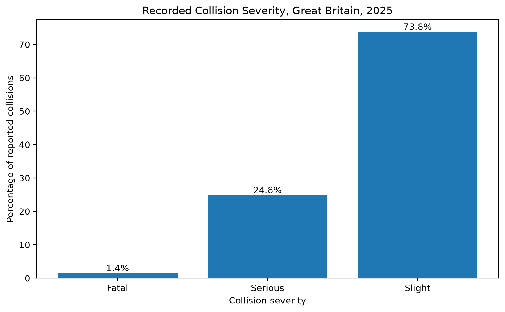

_Figure 1. Distribution of recorded collision severity among police-reported personal-injury collisions in Great Britain, 2025. Slight collisions form the largest category, while serious and fatal outcomes remain separately visible._

Single carriageways, 30 mph roads and urban areas were the dominant road conditions, while daylight, fine weather and dry surfaces were most common environmentally. These frequencies describe the composition of the recorded dataset rather than relative road-user risk.

## 4. Analysis

Collision counts describe frequency, while within-category fatal-or-serious proportions compare severity across groups of different sizes. Considering both measures avoids treating a large absolute number of severe collisions as evidence that severe outcomes are proportionally more common. Visualisations were selected to match each research question and minimise unnecessary complexity (Kelleher and Wagener, 2011; Qin _et al._, 2020).

### 4.1 Temporal variation in collision frequency (RQ1)

Daily collision totals were plotted alongside a centred seven-day rolling mean. The daily series preserves short-term variation, while the rolling mean reduces day-to-day noise and incorporates one complete weekly cycle.

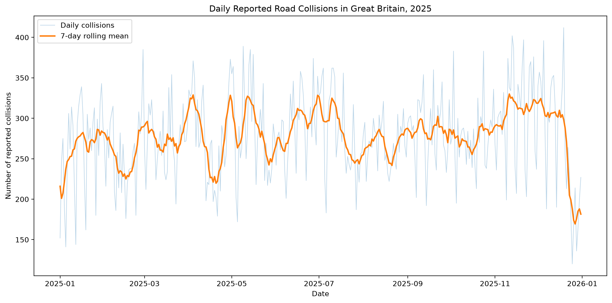

_Figure 2. Daily reported collision frequency across Great Britain in 2025, with a centred seven-day rolling mean showing broader temporal variation._

Daily totals ranged from **120 collisions on 25 December** to **412 on 19 December**. These isolated values alone do not show whether they formed part of wider changes. The rolling mean clarifies this: the highest seven-day mean was centred on **11 November at 330.00 collisions per day**, while the lowest was centred on **27 December at 169.43**. The late-December reduction therefore extended beyond the Christmas Day minimum.

Monthly mean daily frequency was also calculated so that differences in month length did not determine the comparison.

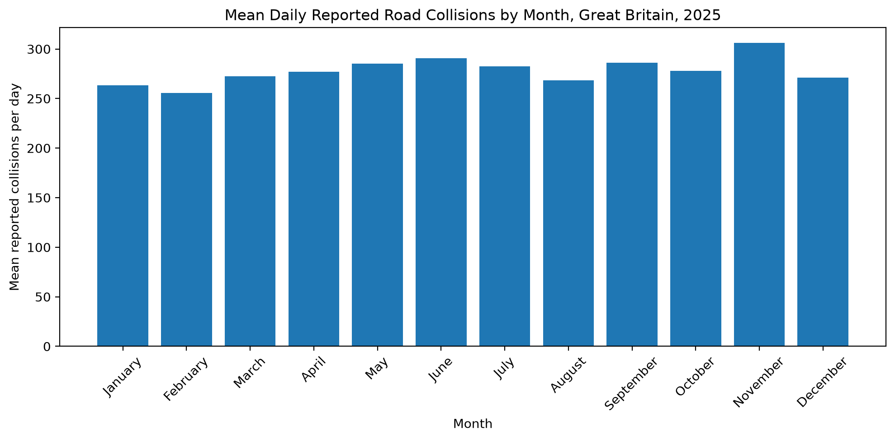

_Figure 3. Mean daily reported collisions by month in Great Britain, 2025._

November had the highest mean daily frequency (**306.20**) and February the lowest (**255.54**), a difference of approximately **19.8%**. Together, Figures 2 and 3 show variation at both short and broader temporal scales. These values describe reported collision frequency rather than travel risk because corresponding exposure data are unavailable. The monthly comparison also prevents total counts from being inflated simply because some months contain more days, making the monthly pattern easier to interpret consistently.

### 4.2 Temporal variation in collision severity (RQ2)

RQ2 examines whether periods containing many collisions also had higher proportional severity. Fatal and serious collisions were combined and expressed as a proportion of all collisions within each temporal group, allowing comparisons independently of group size.

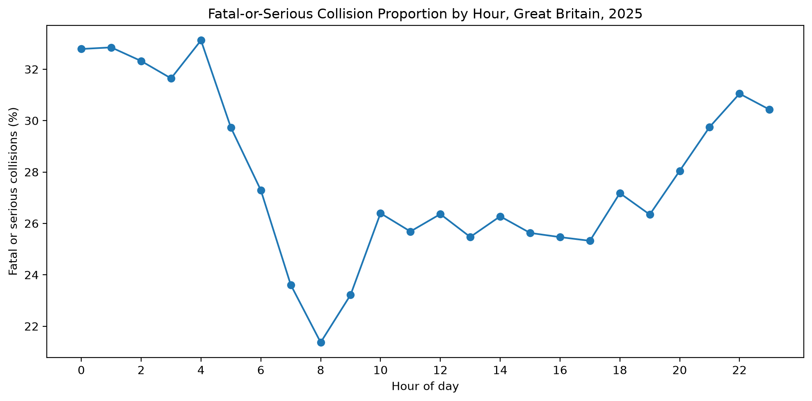

_Figure 4. Fatal-or-serious proportion of reported collisions by hour of day in Great Britain, 2025._

At **04:00, 33.12%** of collisions were fatal or serious, compared with **21.37% at 08:00**. Higher proportions were generally visible overnight, declining through the morning before increasing later in the day.

This differed from frequency. **17:00 contained the most collisions**, but its fatal-or-serious proportion was **25.32%**, substantially below the 33.12% recorded at 04:00. The busiest hour was therefore not the hour in which severe outcomes formed the largest share.

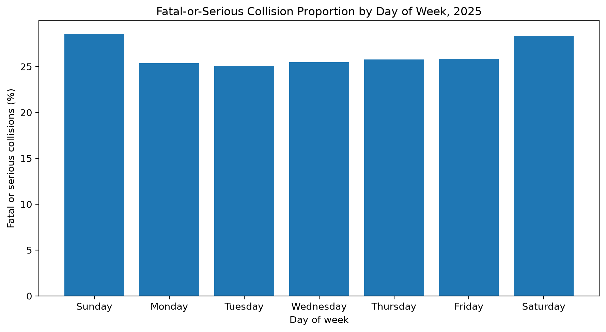

_Figure 5. Fatal-or-serious proportion of reported collisions by weekday in Great Britain, 2025._

Weekday variation was narrower. Sunday had the highest proportion (**28.55%**), closely followed by Saturday (**28.39%**), while Tuesday was lowest (**25.08%**). Collision frequency, however, was highest on Friday.

The weekday-hour interaction was then examined using a heatmap, which displays both temporal dimensions simultaneously.

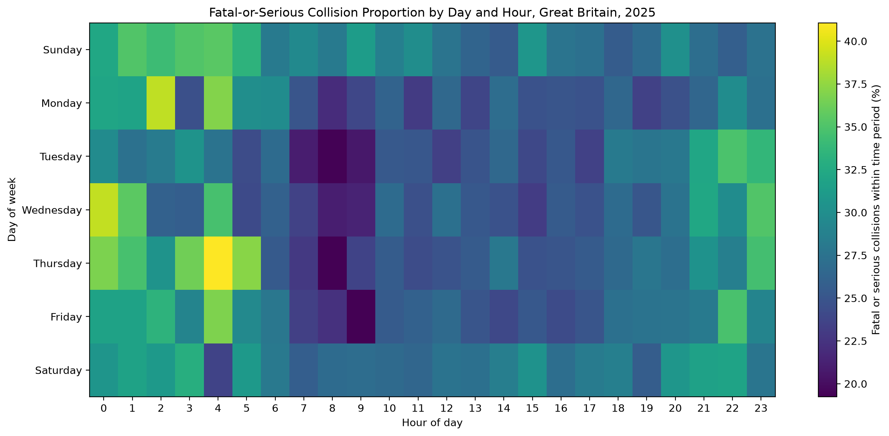

_Figure 6. Fatal-or-serious proportion by weekday and hour in Great Britain, 2025._

Proportions ranged from **19.24% for Thursday at 08:00** to **41.07% for Thursday at 04:00**. However, weekday-hour groups ranged from **55 to 1,530 collisions**, so isolated extreme cells may be unstable. The repeated overnight/daytime pattern is therefore more informative than the single largest value.

### 4.3 Geographical distribution and severity (RQ3)

Plotting more than 100,000 individual coordinates caused substantial overplotting and saturation. Hexagonal aggregation was therefore used to group nearby observations into consistent spatial cells, making differences in concentration easier to compare. Three maps show overall collision concentration, fatal-or-serious concentration and within-cell proportional severity.

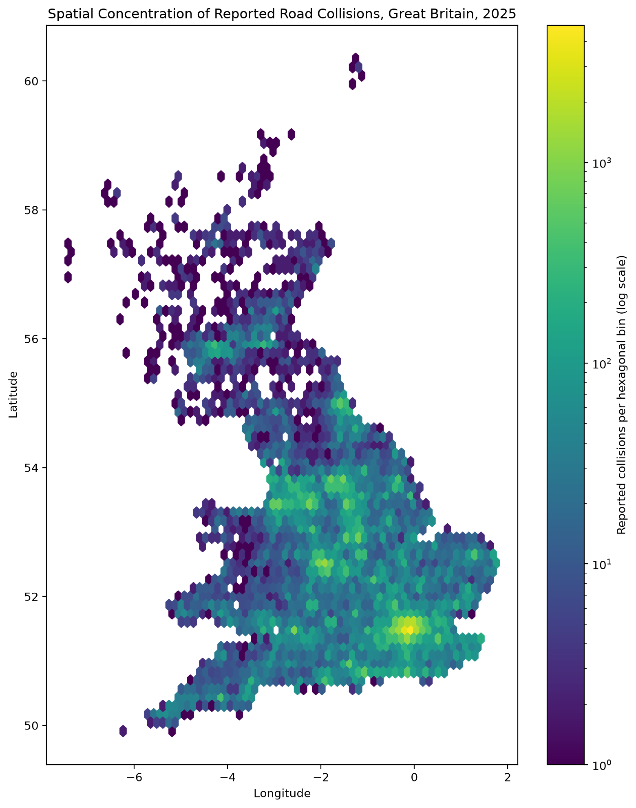

_Figure 7. Spatial concentration of reported personal-injury collisions across Great Britain in 2025, aggregated into hexagonal cells._

Overall collisions were strongly geographically concentrated rather than uniformly distributed. This identifies where reported collisions were most numerous but does not show the severity composition within those locations.

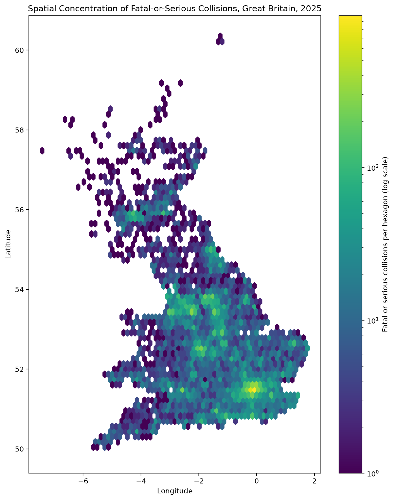

_Figure 8. Spatial concentration of fatal-or-serious reported collisions across Great Britain in 2025._

Of **101,523 collisions, 26,643 (26.24%)** were fatal or serious. Their absolute spatial distribution broadly followed overall collision concentration, as locations with many collisions also tended to contain more severe collisions in absolute terms.

A different pattern emerged when severity was expressed as a proportion within each cell.

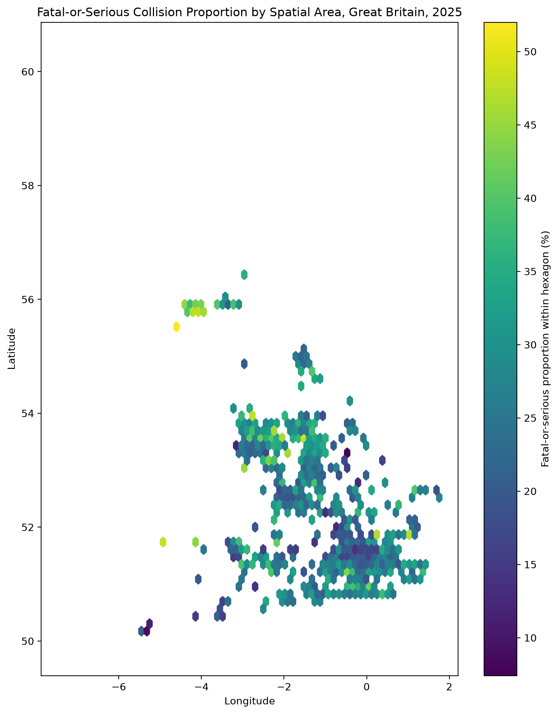

_Figure 9. Within-cell fatal-or-serious proportion across Great Britain in 2025; only cells containing at least 50 collisions are shown._

Cells with fewer than **50 collisions** were excluded to reduce instability from small denominators. This left **414 hexagons**, with fatal-or-serious proportions ranging from **7.41% to 52.00%** and a median of **26.80%**. Unlike the count maps, Figure 9 shows where severe outcomes comprised a larger share of collisions. High overall concentration did not consistently correspond to high proportional severity.

The maps therefore answer related but distinct questions: Figures 7 and 8 show absolute concentration, whereas Figure 9 shows severity composition. Results remain sensitive to grid resolution and the 50-collision threshold, and they do not represent geographical risk because traffic exposure varies spatially but is not included. This distinction is analytically important because a location can appear prominent on the severe-collision count map solely because it contains many collisions overall. The proportional map instead highlights cells where severe outcomes form an unusually large share of recorded collisions, which changes the spatial interpretation.

### 4.4 Road environment and collision outcomes (RQ4)

Road type, speed limit and urban/rural classification were compared using both collision frequency and fatal-or-serious proportion.

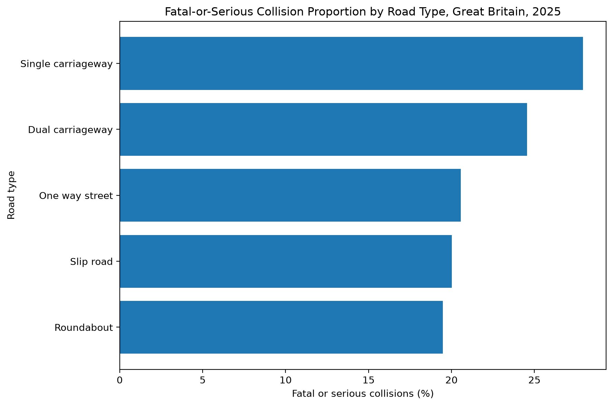

_Figure 10. Fatal-or-serious proportion of reported collisions by road type in Great Britain, 2025._

Single carriageways accounted for **74,149 collisions (74.47% of known road types)** and also had the highest fatal-or-serious proportion among substantive road-type categories (**27.92%**), compared with **19.47% for roundabouts**. A further 1,952 observations had unknown road type and were excluded from this comparison.

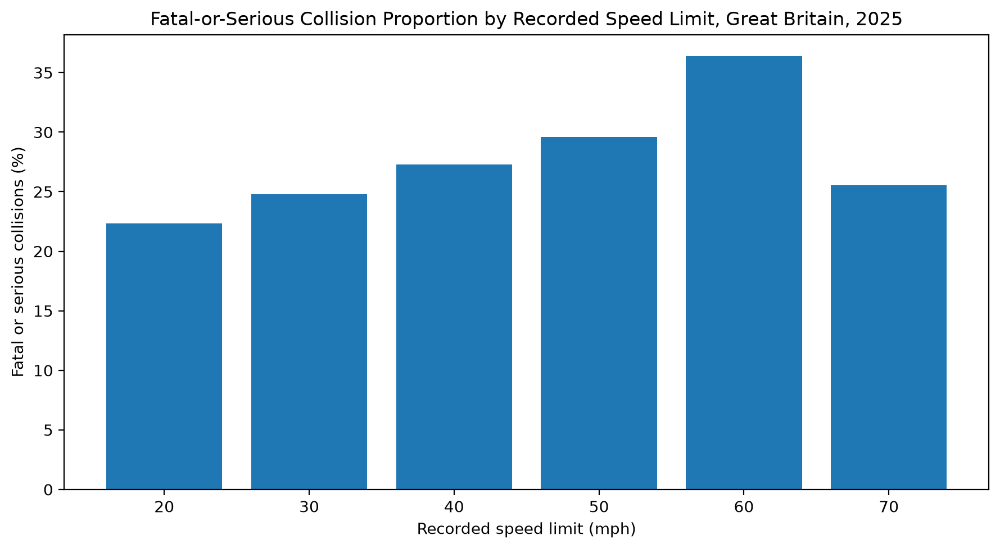

_Figure 11. Fatal-or-serious proportion of reported collisions by recorded speed limit in Great Britain, 2025._

Roads with a **30 mph** limit contained the most collisions (**49,673**), of which **24.81%** were fatal or serious. Proportional severity increased from **22.35% on 20 mph roads** to **36.38% on 60 mph roads**, then fell to **25.54% on 70 mph roads**. Recorded severity therefore did not increase monotonically with posted speed limit; the highest proportion occurred at 60 mph.

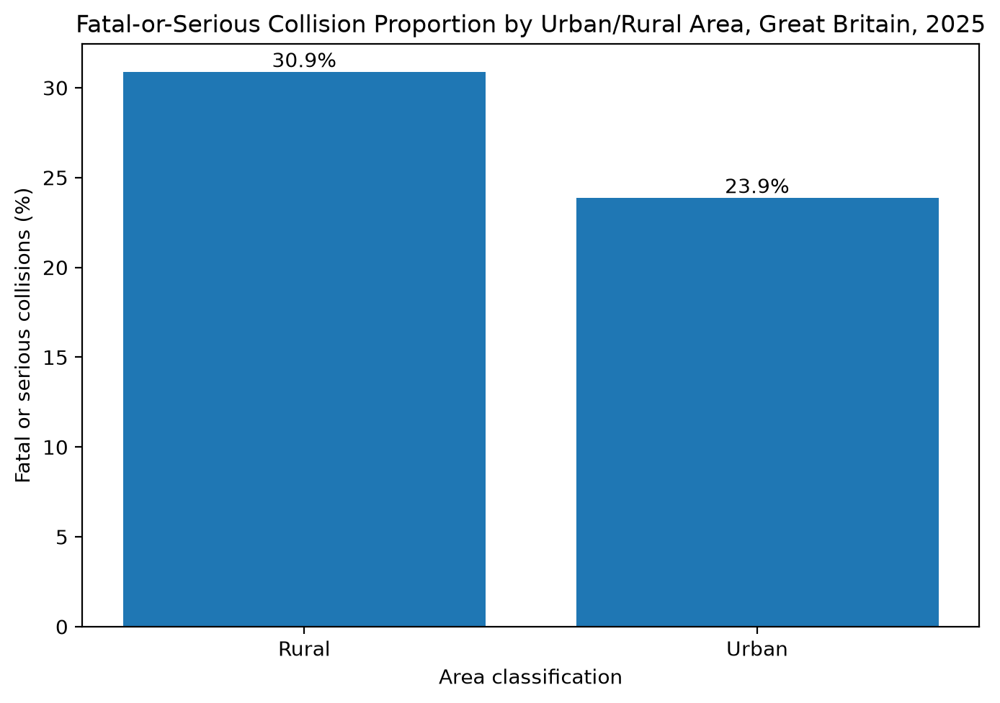

_Figure 12. Fatal-or-serious proportion of reported collisions in urban and rural areas of Great Britain, 2025._

Urban areas contained **67,148 collisions**, compared with **34,373 in rural areas**. Despite the greater urban volume, fatal-or-serious outcomes represented **30.88% of rural collisions** versus **23.87% of urban collisions**. This again separates collision frequency from severity composition.

These relationships are descriptive rather than causal. Road type, speed limit and urban/rural classification are interrelated and may also reflect differences in road design, traffic density, road-user composition and actual travelling speed that cannot be isolated by these visual comparisons. The 60 mph result therefore should not be read as evidence that the posted limit itself causes greater severity; it may partly reflect the types of roads and journeys represented within that category.

### 4.5 Environmental conditions and collision outcomes (RQ5)

Lighting, weather and road-surface conditions were compared using frequency and proportional severity, with particular caution for categories containing few observations.

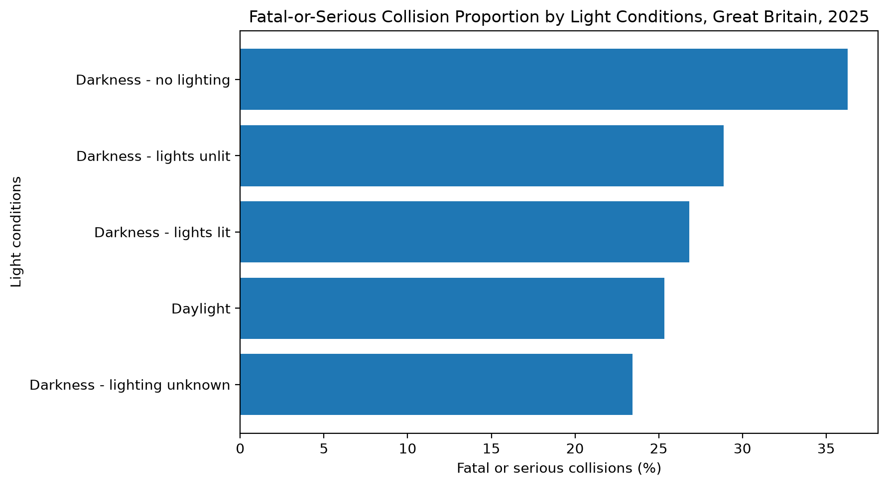

_Figure 13. Fatal-or-serious proportion of reported collisions by light condition in Great Britain, 2025._

Daylight accounted for **72,812 collisions (71.73% of known lighting conditions)**, with **25.33%** fatal or serious. In contrast, **darkness with no lighting** had the highest proportion (**36.29%**) across 5,682 observations. The most common lighting condition was therefore not the one with the greatest proportional severity.

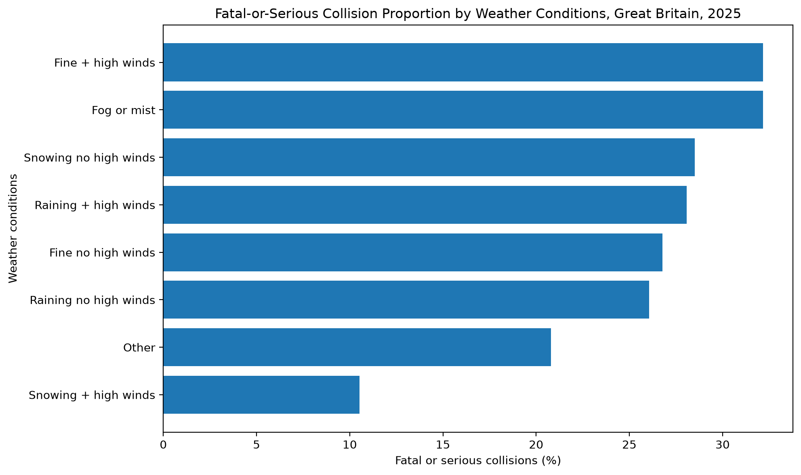

_Figure 14. Fatal-or-serious proportion of reported collisions by weather condition in Great Britain, 2025._

Fine weather without high winds accounted for **83,404 collisions (84.13% of known weather observations)**, with **26.78%** fatal or serious. Higher proportions occurred in fine weather with high winds (**32.17%**) and fog or mist (**32.16%**). These categories were much smaller, however, and only **19 collisions** occurred during snow with high winds, so extreme percentages in rare categories are less stable.

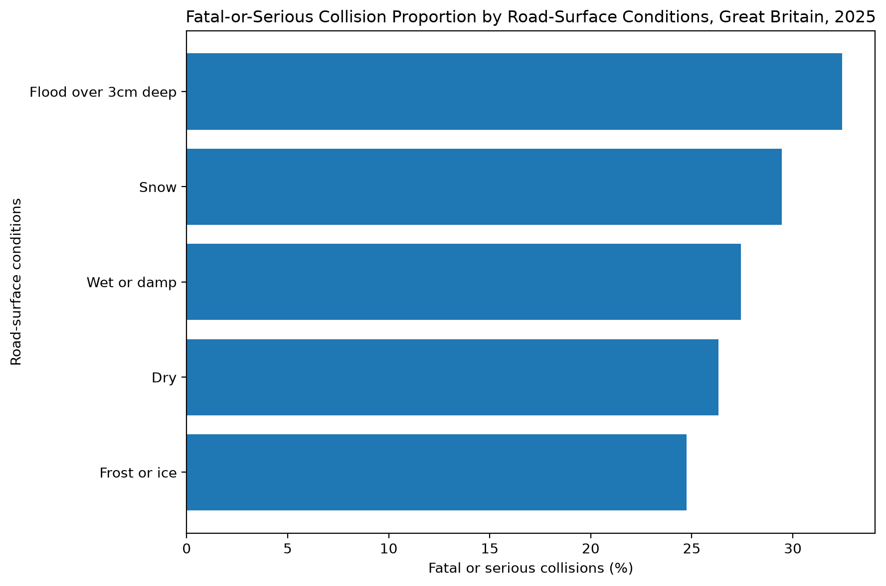

_Figure 15. Fatal-or-serious proportion of reported collisions by road-surface condition in Great Britain, 2025._

Dry roads accounted for **75,678 collisions (76.02% of known surface conditions)** and had a fatal-or-serious proportion of **26.33%**. Flooding over 3 cm had the highest observed proportion (**32.45%**) but only **151 collisions**. Wet or damp roads provide a more stable comparison at **27.44%**, only slightly above dry roads.

Across the three environmental variables, the most common conditions were not consistently those associated with the highest proportional severity. The distinction was clearest for lighting, while results for uncommon weather and surface categories require more cautious interpretation because of their smaller sample sizes. Lighting provides the strongest environmental comparison because the higher proportion in unlit darkness is based on several thousand observations, whereas the apparent extremes for flooding or unusual weather depend on much smaller groups. This difference in denominator size is central to judging how much weight to place on each visual pattern.

## 5. Conclusion and Evaluation

Across all five research questions, collision frequency and proportional severity produced different but complementary patterns. Collisions were most frequent at 17:00, in urban areas and on 30 mph roads, whereas higher fatal-or-serious proportions occurred at 04:00, in rural areas and on 60 mph roads. Environmental and spatial analyses showed the same broader distinction: high collision volume did not necessarily indicate high proportional severity.

The visualisation strategy was matched to the structure of each question. A seven-day rolling mean separated short-term fluctuation from broader temporal variation, while the weekday-hour heatmap combined two temporal dimensions efficiently. Hexagonal aggregation reduced severe overplotting from more than 100,000 coordinates and enabled comparison of overall collision concentration, severe-collision concentration and within-cell severity proportion. These choices follow the principle that effective visualisation should simplify complex data while preserving the relationship the reader needs to interpret (Kelleher and Wagener, 2011; Qin _et al._, 2020).

Several limitations constrain interpretation. STATS19 records police-reported personal-injury collisions rather than all road collisions (Department for Transport, 2026a), and the absence of traffic-flow, journey or exposure denominators prevents counts or proportions from being interpreted directly as individual risk. The analysis is observational, so associations with speed limit, road type, lighting or other conditions do not establish causal effects. These characteristics may be related to road design, traffic density, actual travelling speed and road-user composition.

Some results are also sensitive to analytical choices. Spatial findings depend on the selected hexagon resolution and 50-collision threshold, while high severity percentages in rare weather and surface categories are less stable than estimates from larger groups. Combining fatal and serious collisions into one indicator enabled consistent comparison but removed the distinction between the original severity levels.

Future work could incorporate multiple years of STATS19 data to test whether 2025 patterns persist. Linking collision records with traffic-flow or exposure measures would allow rates to be calculated rather than relying on collision counts alone. Spatial analysis could use road-network or administrative-boundary data, while multivariable modelling could assess whether observed relationships remain after related factors are controlled.

Overall, using both frequency and proportional severity prevented high-volume categories from being interpreted automatically as high-severity categories and produced a more nuanced account of reported road-collision patterns in 2025.

## 6. Critical Engagement with AI

Generative AI, ChatGPT (OpenAI), was used as a supporting tool during the project for background research, Python debugging, visualisation prototyping, report planning and language revision. It was not treated as a source of empirical evidence, and AI-generated suggestions were not accepted automatically. Instead, outputs were used as provisional material that required checking against the dataset, notebook results, official documentation and the requirements of the coursework brief.

AI was particularly useful when considering alternative technical and visualisation approaches. For example, different methods of presenting the geographical distribution of more than 100,000 collision coordinates were considered before hexagonal aggregation was retained because it reduced overplotting while preserving spatial concentration patterns. Similarly, comparisons based only on absolute numbers of fatal or serious collisions was reconsidered because categories contained very different numbers of observations. The final analysis therefore used within-category fatal-or-serious proportions alongside collision frequencies. These decisions were not based solely on AI suggestions; they were retained only after inspecting the resulting outputs and determining whether they answered the research questions clearly.

All AI-supported outputs were independently checked before inclusion. Suggested code was executed within the complete notebook and the resulting tables and visualisations were inspected rather than assuming that syntactically correct code was analytically appropriate. References identified during the research and drafting process were also checked against the original publications or official sources before being cited.

AI was additionally used to support organisation, concision and clarity during report revision. Final responsibility for selecting variables, determining preprocessing decisions, formulating the research questions, choosing the submitted visualisations and interpreting the results remained with the author. AI therefore functioned as a technical, research and writing-support tool rather than an authoritative analytical source.

<!-- WORDCOUNT_END -->

---

## 7. Reference List

Department for Transport (2026a) Road safety open data. Available at: https://www.gov.uk/government/statistical-data-sets/road-safety-open-data (Accessed: 5 September 2026).

Department for Transport (2025) Road safety statistics: guidance. Available at: https://www.gov.uk/guidance/road-accident-and-safety-statistics-guidance (Accessed: 5 September 2026).

Kelleher, C. and Wagener, T. (2011) ‘Ten guidelines for effective data visualization in scientific publications’, Environmental Modelling & Software, 26(6), pp. 822–827. doi: 10.1016/j.envsoft.2010.12.006.

Qin, X., Luo, Y., Tang, N. and Li, G. (2020) ‘Making data visualization more efficient and effective: a survey’, The VLDB Journal, 29(1), pp. 93–117. doi: 10.1007/s00778-019-00588-3.

OpenAI (2026) ChatGPT [Large language model]. Available at: https://chatgpt.com/ (Accessed: 5 September 2026).

\vspace{1.5em}

_[Word count: 3,092 words]_
